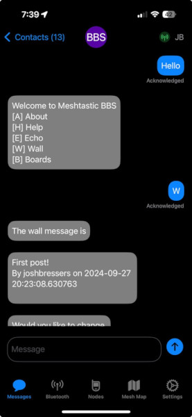

# meshbbs

This is a BBS project to run on a meshtastic node. The project was forked from https://github.com/TheCommsChannel/TC2-BBS-mesh and has been heavily modified. They deserve credit for the initial idea and code.

This project is VERY VERY early, so be nice and patient. The code isn't amazing, the model to get and send message was designed to be easy for anyone to write plugins, not to be "correct". You'll understand when you look at the code :)

## Getting started

Make sure you have poetry installed
https://python-poetry.org/

You will need to copy the file `examples/example_config.ini` to config.ini. You should be able to figure this file out if you look in it. You can talk to a meshtastic node via serial or TCP/IP. There is also a debug interface that you can run to type commands to the BBS locally to test things out. I would like to see this also run on a raspberry pi with a LoRa hat someday.

You should be able to run `poetry install` to install all the dependencies, then run `poetry run meshbbs` and the BBS will start to run.

Just send the message "hello" to the BBS and it will get you going.

You may want to change your mesh node long name to "hello to start BBS" or something similar.

# Contributing

Patches are welcome! Issues are also just fine if you're not looking to send a PR.

The biggest part of the rewrite was to make adding functionality easy. You should look in the "stages" directory to see how modules can be added to the system. Even though it's event driven, the BBS is designed to run synchronous code (this is easier to write and read).

The `main()` function exists in the server.py file. You can start there if you want to see how the sausage is made. Otherwise I would suggesting looking at the `wall.py` and `main.py` in the stages directory.

## License

GNU General Public License v3.0
